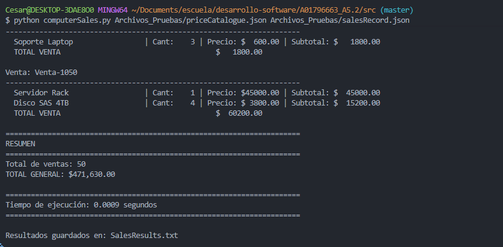
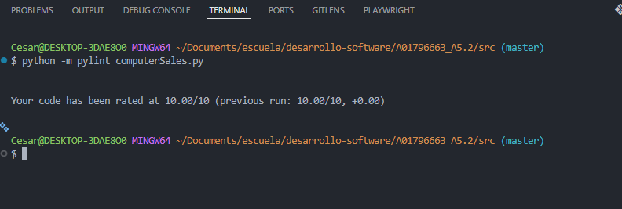
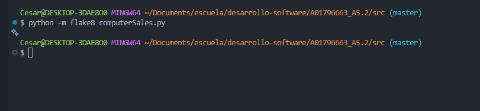

# Actividad 5.2 Ejercicio de programación 2 y análisis estático

## Objetivos
2.7 Explicar la diferencia entre pruebas dinámicas y pruebas estáticas
2.8 Describir los beneficios e impacto de la calidad de las prácticas asociadas a pruebas estáticas.
2.9 Explicar el origen de las inspecciones como herramienta de pruebas estáticas.
2.10 Describir las diferencias entre revisiones informales, caminatas estructuradas, inspecciones e inspecciones automáticas.
2.11 Describir la relación de las herramientas de análisis estático y el código fuente.
2.12 Experimentar con el uso de herramientas de análisis estático en el código fuente.

---

## Datos de entrega

* **Nombre:** Cesar Camilo.
* **Materia:** Pruebas de software y aseguramiento de la calidad.
* **Profesor:** Dr. Gerardo Padilla Zárate.
* **Fecha:** 13 de febrero 2026.
* **Actividad** 5.2 Ejercicio de programación 2 y análisis estático.
---

## Caracteristicas

### Programa 2: computeSales.py
| Programming Exercise | Description | Practice | Test Cases and Evidence |
| --- | --- | --- | --- |
| 1. Compute sales | Req1. The program shall be invoked from a command line. The program shall receive two files as parameters. The first file will contain information in a JSON format about a catalogue of prices of products. The second file will contain a record for all sales in a company. | • Control structures | Record the execution. Use files included in the assignment. |
|  | Req 2. The program shall compute the total cost for all sales included in the second JSON archive. The results shall be print on a screen and on a file named *SalesResults.txt*. The total cost should include all items in the sale considering the cost for every item in the first file.| • Mathematical computation |  |
|  | Req 3. The program shall include the mechanism to handle invalid data in the file. Errors should be displayed in the console and the execution must continue.| • File management |  |
|  | Req 4. The name of the program shall be computeSales.py | • Error handling |  |
|  | Req 5. The minimum format to invoke the program shall be as follows: python computeSales.py priceCatalogue.json salesRecord.json 
|  | Req 6. The program shall manage files having from hundreds of items to thousands of items. |  |  |
|  | Req 7. The program should include at the end of the execution the time elapsed for the execution and calculus of the data. This number shall be included in the results file and on the screen. |  |  |
|  | Req 8. Be compliant with PEP8. |  |  |

---


## Estructura del proyecto

```
A01796663_A5.2/
│
├── README.md                          # documentación
│
└── src/
    ├── computerSales.py               # Programa principal en python
    │
    ├── Archivos_Pruebas/              # Archivos JSON
    │   ├── priceCatalogue.json        
    │   ├── salesRecord.json          
    │   └── salesRecordWErrors.json  
    │
    ├── imagenes_pruebas/              # SS de las ejecuciones
    │   ├── image.png                  
    │   └── prueba_plint.png           
    │
    └── Resultados/
        └── SalesResults.txt           # Archivo de resultados en .txt
```

---

## Cómo ejecutar el programa

Ejecutar el programa

El programa necesita **dos archivos JSON** como parámetros: el catálogo de precios y el registro de ventas. Así se ejecuta:

```bash
python computerSales.py Archivos_Pruebas/priceCatalogue.json Archivos_Pruebas/salesRecord.json 
```

Cada ejecución va a mostrarte en pantalla el costo total de las ventas y el tiempo que tardó en calcularlo. Además, genera automáticamente un archivo llamado `SalesResults.txt`.

### Análisis estático con pylint y flake8

Para verificar que el código cumple con PEP8 y no tie problemas ejecutamos el siguiente comando: 
```bash
python -m pylint computerSales.py
flake8 computeSales.py
```

---

## Resultados

### Ejecución del programa


### Ejecución de Pylint


### Ejecución de Flake8



### Gracias